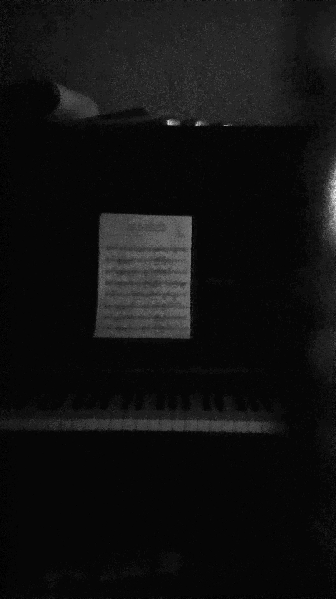

# image_denoize
Simple denoise algorithm with image averaging

## Samples
* All images below are normalized. real video is much more dark.  
 
A. A normalized frame in video(TestFile1.mp4)  
  
---
B. Average-denoized frame  
  
---
C. A normalized frame in video(TestFile2.mp4)  
  
---
D. Average-denoized frame  
  
